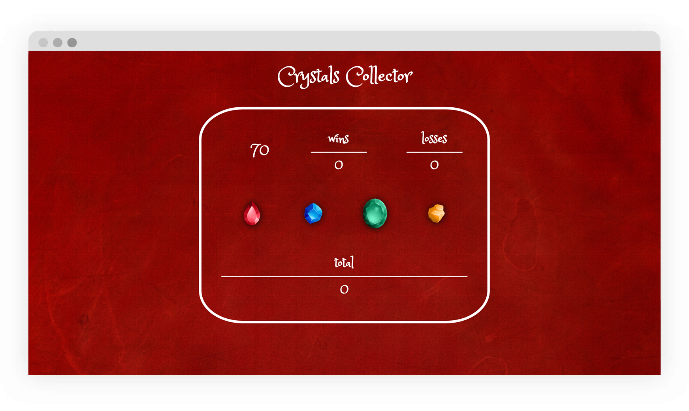

# Crystals-Collector
> Crystals Collector is a front-end web game that's a bit of a brain teaser!

## Technologies Used

- HTML5
- CSS
- JavaScript
- jQuery
- Bootstrap

## How to Play

- You will be given a random number at the start of the game.
- By clicking on a crystal, you will add a specific amount of points to your total score.
- You will win by matching your total score to the random number. You will lose the game if your total score goes above the random number.
- The value of each crystal is hidden from you until you click on it.
- Each time the game starts, the game will change the value of each crystal.

## Features

- Supplies a random number at the start of every game.
- Supplies a hidden random value for each crystal, only to be revealed when it is added to the user's total score after being clicked.
- Maintains user's total score with every click on a crystal.
- Automatically restarts game when the user has won or lost. 
- Maintains a history of high scores that displays games won and lost.
